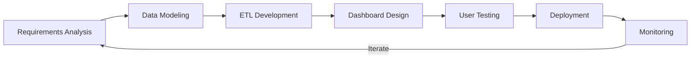

# README-
<div align="center">
  
  <h3>💼 Data Engineering & Analytics Professional</h3>
  <p><em>Transforming Data into Actionable Intelligence</em></p>
  
  <p>
    <a href="https://www.linkedin.com/in/sandulavinay"></a>
    <a href="mailto:sandulavinay@gmail.com"></a>
    <a href="https://sandulavinayresume.my.canva.site/"></a>
  </p>
</div>

## 🛠️ Technical Arsenal

<table>
  <tr>
    <td align="center" width="96">
      
      <br>Python
    </td>
    <td align="center" width="96">
      
      <br>SQL Server
    </td>
    <td align="center" width="96">
      
      <br>MySQL
    </td>
    <td align="center" width="96">
      
      <br>Oracle
    </td>
    <td align="center" width="96">
      
      <br>Excel
    </td>
    <td align="center" width="96">
      
      <br>Power BI
    </td>
  </tr>
  <tr>
    <td align="center" width="96">
      
      <br>Git
    </td>
    <td align="center" width="96">
      
      <br>GitHub
    </td>
    <td align="center" width="96">
      
      <br>GitLab
    </td>
    <td align="center" width="96">
      
      <br>Azure
    </td>
    <td align="center" width="96">
      
      <br>Scala
    </td>
    <td align="center" width="96">
      
      <br>PowerShell
    </td>
  </tr>
</table>

### Data Engineering & Analytics

- **Data Integration**: ETL/ELT Workflows, Data Pipelines, API Integration
- **Database Engineering**: Schema Design, Query Optimization, Stored Procedures
- **Business Intelligence**: KPI Dashboards, Advanced Visualizations, Strategic Reporting
- **Data Modeling**: Dimensional Modeling, Star/Snowflake Schemas, ERD
- **Advanced Analytics**: Predictive Modeling, Statistical Analysis, Data Mining

### Tools & Technologies  

- **Power BI**: DAX, M Language, Advanced Visualizations, Row-Level Security, Composite Models
- **SQL**: Complex Joins, Window Functions, CTEs, Stored Procedures, Performance Tuning
- **Python**: Pandas, NumPy, Matplotlib, Seaborn, scikit-learn, Streamlit
- **Version Control**: Git, GitHub Actions, CI/CD for Data Projects
- **Collaboration**: Agile Methodology, JIRA, Confluence

## 🚀 Featured Projects

<table>
  <tr>
    <td width="50%">
      <h3 align="center">Security Configuration Monitoring System</h3>
      <div align="center">
        <a href="https://github.com/sandulavinay/security-config-monitor" target="_blank">
          
        </a>  
        <p>
          <strong>Power BI • PL/SQL • Oracle • Python • PowerShell</strong>
        </p>
        <p>
          Architected an enterprise-grade security monitoring solution that tracks real-time changes to critical database configurations. The system features automated alerting, historical audit trails, and comprehensive compliance reporting.
        </p>
        <ul>
          <li>Reduced security incident response time by 65%</li>
          <li>Automated compliance documentation process, saving 20+ hours monthly</li>
          <li>Implemented incremental refresh patterns for optimal performance</li>
        </ul>
      </div>
    </td>
    <td width="50%">
      <h3 align="center">Data Pipeline Automation Framework</h3>
      <div align="center">
        <a href="https://github.com/sandulavinay/data-pipeline-framework" target="_blank">
          
        </a>
        <p>
          <strong>Python • SQL • GitHub Actions • Azure Data Factory</strong>
        </p>
        <p>
          Designed a modular data pipeline framework that standardizes ETL processes across multiple data sources. The solution features dynamic parameter handling, error logging, and automatic retry logic.
        </p>
        <ul>
          <li>Reduced development time for new data pipelines by 40%</li>
          <li>Implemented comprehensive logging and monitoring</li>
          <li>Created reusable components for common transformation patterns</li>
        </ul>
      </div>
    </td>
  </tr>
  <tr>
    <td width="50%">
      <h3 align="center">Executive Analytics Dashboard Suite</h3>
      <div align="center">
        <a href="https://github.com/sandulavinay/executive-analytics" target="_blank">
          
        </a>
        <p>
          <strong>Power BI • DAX • M Query • SQL Server</strong>
        </p>
        <p>
          Developed a suite of interconnected dashboards providing C-level executives with cross-functional KPIs and drill-down capabilities for strategic decision making.
        </p>
        <ul>
          <li>Created advanced DAX measures for year-over-year comparisons</li>
          <li>Implemented row-level security for departmental data segregation</li>
          <li>Designed mobile-optimized layouts for on-the-go access</li>
        </ul>
      </div>
    </td>
    <td width="50%">
      <h3 align="center">Predictive Maintenance System</h3>
      <div align="center">
        <a href="https://github.com/sandulavinay/predictive-maintenance" target="_blank">
          
        </a>
        <p>
          <strong>Python • Pandas • scikit-learn • SQL • Power BI</strong>
        </p>
        <p>
          Built an end-to-end system that predicts equipment failures before they occur by analyzing historical maintenance data and sensor readings using machine learning algorithms.
        </p>
        <ul>
          <li>Achieved 87% accuracy in predicting maintenance needs</li>
          <li>Integrated IoT sensor data with existing maintenance records</li>
          <li>Deployed interactive visualizations for maintenance planning</li>
        </ul>
      </div>
    </td>
  </tr>
</table>

## 📜 Professional Development & Certifications

<div align="center">

| Certification | Issuing Organization | Year |
|---------------|----------------------|------|
| Microsoft Certified: Power BI Data Analyst Associate | Microsoft | 2023 |
| Oracle Database SQL Certified Associate | Oracle | 2022 |
| Azure Data Engineer Associate | Microsoft | 2023 |
| Advanced DAX for Power BI | SQLBI | 2023 |
| Python for Data Science and Machine Learning | Udemy | 2022 |

</div>

### 🎓 Continuous Learning Path

- **Current Focus**: Advanced Data Engineering Patterns, MLOps, Data Governance
- **Reading List**: "The Data Warehouse Toolkit" by Kimball, "Storytelling with Data" by Knaflic
- **Learning Resources**: DataCamp, Pluralsight, Microsoft Learn, YouTube (Guy in a Cube, SQLBI)

## 📊 GitHub Metrics & Contributions

<div align="center">
  
  
</div>

<div align="center">
  
</div>

<div align="center">
  
</div>

### 🏆 GitHub Achievements

<div align="center">
  
</div>

## 💼 Professional Workflow & Methodologies

<div align="center">
  <table>
    <tr>
      <td align="center">
        
        <br />Agile Methodology
      </td>
      <td align="center">
        
        <br />VS Code
      </td>
      <td align="center">
        
        <br />JIRA
      </td>
      <td align="center">
        
        <br />Office Suite
      </td>
      <td align="center">
        
        <br />Confluence
      </td>
      <td align="center">
        
        <br />Dark Mode
      </td>
    </tr>
  </table>
</div>

### 🔄 Development Cycle



### 📊 Data Architecture Philosophy

> "I believe in building data solutions that are not just technically sound but also intuitive for business users. My approach balances performance optimization with user experience, ensuring that the insights derived are both accurate and actionable."

## 🌱 Current Learning & Development

```yaml
# Technical Areas of Focus:
- Advanced Data Engineering:
  - Apache Spark & Databricks
  - Streaming Data Architectures (Kafka, Azure Event Hubs)
  - Modern Data Warehousing

- Power BI Advanced Techniques:
  - Tabular Editor & External Tools
  - Advanced DAX Patterns
  - Composite Models & DirectQuery

- Programming & Automation:
  - Python for Data Engineering
  - GitHub Actions for CI/CD
  - Infrastructure as Code
```

## 🤝 Connect & Collaborate

I'm always open to discussing:
- Data engineering best practices
- Power BI optimization techniques
- Database performance tuning
- Security analytics & monitoring solutions
- Mentoring junior data professionals

Feel free to reach out if you're working on interesting data projects or looking for collaboration opportunities!

## 🧘‍♂️ Beyond the Code

When I'm not immersed in data, you might find me:
- 📚 Reading books on data science, leadership, and non-fiction
- ♟️ Playing chess and developing strategic thinking
- 🌱 Exploring new technologies through hands-on projects
- 📝 Writing technical articles to share knowledge
- 🔍 Solving complex problems through creative approaches

---

<div align="center">
  
  
  <p>Let's connect and build amazing data solutions together!</p>
  
  <a href="https://www.linkedin.com/in/sandulavinay">
    
  </a>
</div>
